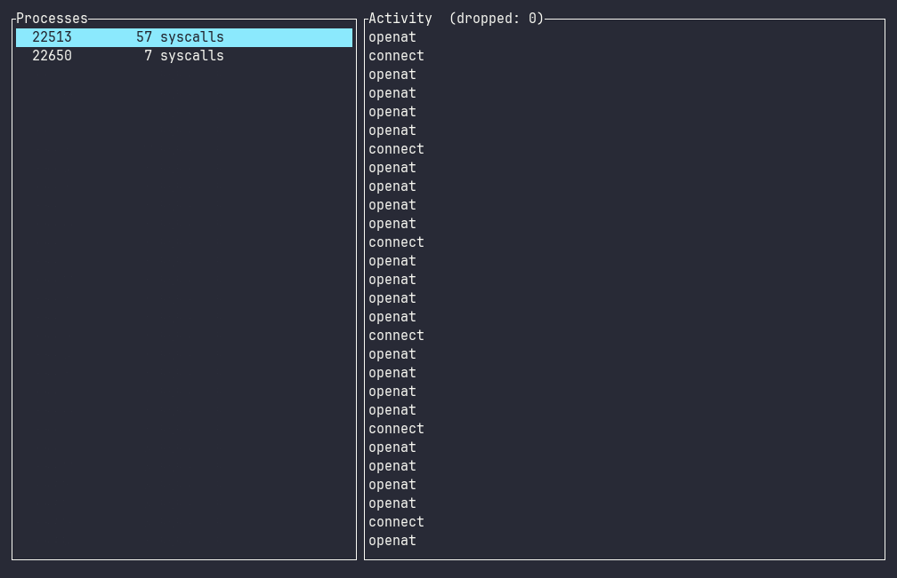

<h1 align="center">procscope</h1>

<p align="center">
  <b>See what every process on your Linux box is actually doing — files, network, syscalls — live, via eBPF.</b>
</p>

<p align="center">
  
  
  
  
  <a href="https://github.com/090TYPE/procscope/actions/workflows/ci.yml"></a>
</p>

<p align="center">
  
</p>

---

## Why

`strace` shows one process as a wall of text. `htop` shows CPU and memory but not
*what* a process does. **procscope** shows every process's file, network and
syscall activity **live**, in a TUI, using low-overhead eBPF.

Sibling project: [**memscope**](https://github.com/090TYPE/memscope) — a live C++
heap visualizer. Same idea ("see it as it runs"), different layer.

---

## Quick start

```bash
# one-time: the BPF linker
cargo install bpf-linker

# build the kernel-side eBPF object (nightly + BPF target, standalone workspace)
( cd procscope-ebpf && cargo +nightly build \
    --target bpfel-unknown-none -Z build-std=core --release )

# build the userspace binary
cargo build --release

# run it
sudo ./target/release/procscope            # watch everything
sudo ./target/release/procscope -p 1234    # watch one PID
sudo ./target/release/procscope -- curl example.com   # launch and watch
```

Requires Linux with eBPF support and `CAP_BPF` (or root). Keys: `↑/↓` select a
process, `q` quits.

---

## Run via Docker (any OS)

No Rust toolchain needed. Works anywhere Docker runs on a BTF-enabled Linux
kernel — including **Docker Desktop on Windows/macOS** (WSL2 / the Linux VM
backend).

```bash
./run.sh            # Linux / macOS
./run.sh -p 1234    # forward args to procscope
```

```powershell
.\run.ps1           # Windows (PowerShell)
```

Or by hand:

```bash
docker build -t procscope:dev .
docker run --rm -it --privileged --pid=host \
  -v /sys/kernel/btf:/sys/kernel/btf:ro procscope:dev
```

`--privileged` and `--pid=host` let the container load eBPF and see every process
on the host. The image's entrypoint mounts `tracefs` for you.

---

## How it works

```
kernel tracepoint -> ring buffer -> capture -> Event -> model (aggregate) -> ui (render)
```

- `procscope-ebpf` attaches to syscall tracepoints (`openat`, `connect`,
  `execve`, `exit_group`) and pushes events to a ring buffer.
- `procscope` loads it with [`aya`](https://aya-rs.dev), drains the ring buffer,
  aggregates per-PID, and renders with [`ratatui`](https://ratatui.rs).

All host-side logic (`model`, `format`) is pure and unit-tested; the kernel path
is verified on a real Linux box.

---

## Status

MVP. Captures a high-value subset of syscalls (file / network / process). Full
argument decode, flame graphs and recording are on the roadmap.

## License

MIT
